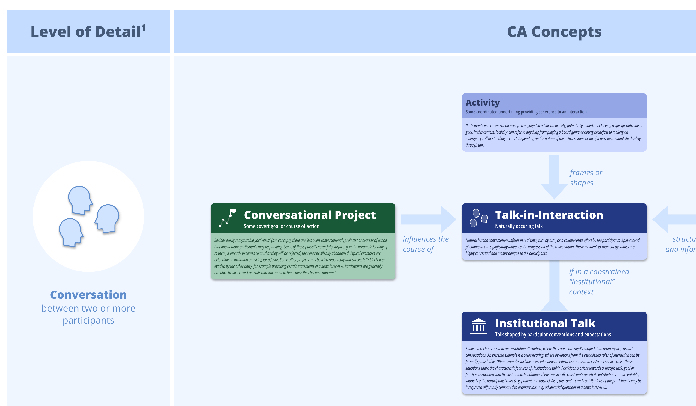

# Visualized CA Concepts

A graphical representation of the main concepts of [conversation analysis](https://en.wikipedia.org/wiki/Conversation_analysis).

With its comprehensive conceptualization of talk-in-interaction, conversation analysis (CA) is beneficial to a wide range of academic and commercial endeavours. This is especially true for the field of conversational AI, where the advent of LLMs promises (but might underdeliver) a new level of natural conversation. For many new to the field, however, the daunting amount of nuanced and heavily interconnected concepts can seem overwhelming at first.

This projects aims to provide a graphical overview of the main concepts of CA and their relations to each other. In addition, it is planned to provide graphical representations of some central ideas of CA in submaps including turn taking and sequence organisation in natural talk.

## Rough Timeline

TODO

## Feedback

Feedback and suggestions are very welcome.
[Create a Github issue](https://github.com/hjbelz/visualized-CA/issues/new/choose) or contact me on LinkedIn: https://www.linkedin.com/in/hansjoachimbelz/
